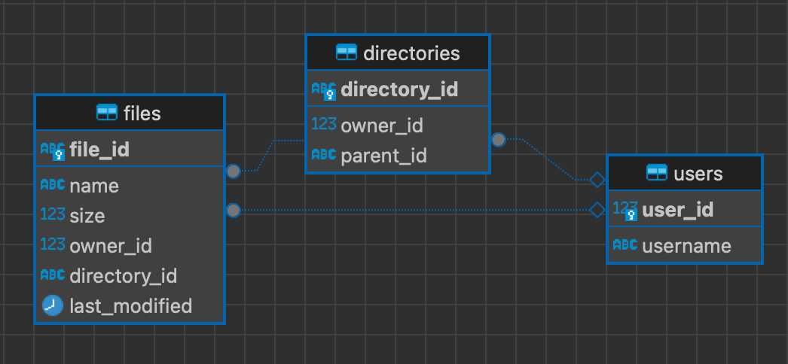

# DiskUsage - Rust

A simple crawler to calculate disk usage of a root directory.

This crawler is written in Rust and uses the `walkdir` crate to traverse the directory tree. It uses `rayon` to parallelize the traversal. Each file and directory's metadata is read using the `std::fs` module (Unix specific). This information is then written to a postgres database using `sqlx`.

## Features
- Crawls the directory tree and calculates the disk usage of each file.
- Uses `rayon` to parallelize the traversal.
- Uses `sqlx` to write the data to a postgres database.
- Estimates the disk usage of a folder, using a recursive query in the database.

## Use Cases
- Calculate the disk usage of an especially large directory.
  - If looking for something more lightweight, consider using the `du` command or [parallel-disk-usage](https://github.com/KSXGitHub/parallel-disk-usage) instead.
- See the owner of the files and directories.
  - Most other programs do only look at the size of the files and directories.

## Prerequisites
- An configured and accessible postgres database.

## Limitations
- The crawler is Unix specific and uses the `std::os::unix::fs::MetadataExt` module to read file metadata.
- The `sqlx` crate requires a valid schema to be present in the database, during compilation. This schema can be generated using the `init_db` binary.
  - This might require partial compilation of the project, which can be done using the `cargo build --bin init_db` command. 

## Usage

1. Build the project:
```bash
cargo run --release -- <root_directory>
```
2. Initialize the database:
```bash
export DATABASE_URL=postgres://<user>:<password>@<host>:<port>/<database>
./target/release/init_db
```
3. Run the crawler:
```bash
export DATABASE_URL=postgres://<user>:<password>@<host>:<port>/<database>
./target/release/disk_usage -r <root_directory>
```

4. Get folder size:
```bash
export DATABASE_URL=postgres://<user>:<password>@<host>:<port>/<database>
./target/release/estimate -p <path>
```

## Database Schema

The database schema is visualized below:

